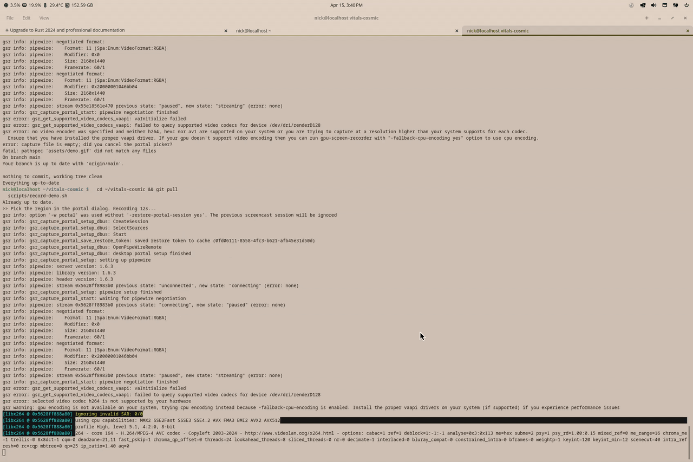

<div align="center">


# vitals-cosmic

**Your system's vital signs, live in the COSMIC panel.**

A native [libcosmic](https://github.com/pop-os/libcosmic) applet that pins your favorite temperature, fan, voltage, memory, CPU, network, storage, battery, and GPU sensors straight onto the [COSMIC desktop](https://system76.com/cosmic) panel. Zero GTK runtime, shared backend with the GNOME Shell extension, and ready for Gentoo.

[](LICENSE)
[](https://www.rust-lang.org/)
[](https://github.com/pop-os/libcosmic)
[]()
[](https://github.com/NicksLameCode/vitals-rs)

[Why](#why-vitals-cosmic) &bull; [Features](#features) &bull; [Architecture](#architecture) &bull; [Install](#install) &bull; [Usage](#usage) &bull; [Configuration](#configuration) &bull; [Status](#feature-status-vs-the-gnome-extension) &bull; [Development](#development)

</div>

<br>

<p align="center">
  
</p>

## Why vitals-cosmic?

Most system monitors on COSMIC are either full-screen GTK apps or drop-in clones of GNOME extensions that drag a GTK runtime along for the ride. **vitals-cosmic** is a single Rust binary built directly against libcosmic and iced -- so it looks, themes, and moves exactly like the rest of the COSMIC panel.

- **Native libcosmic / iced** -- no GTK, no WebKit, no Electron. One binary, sized and themed by cosmic-panel itself.
- **Shared backend with [vitals-rs](https://github.com/NicksLameCode/vitals-rs)** -- the same `vitals-daemon` that powers the Fedora GTK4 app and the GNOME Shell extension. Switch desktops, keep your sensors.
- **Config round-trips through D-Bus** -- every preferences change hits `SetConfig` on the daemon, so `~/.config/vitals/config.toml` stays canonical across every client.
- **Zero sensor-reading code in the applet** -- all 10 sensor categories come from the daemon's 4 RPCs. The applet is a thin presentation layer, nothing more.
- **Star-to-pin** -- any sensor in the popup can be pinned into the panel chip row and will persist across sessions, reboots, and desktop swaps.
- **Gentoo-ready** -- ships with a skeleton ebuild at `gentoo/app-admin/vitals-cosmic/`, drop it into a personal overlay and `emerge --ask`.

## Features

| Feature | What it does |
|---------|--------------|
| **Panel chip row** | One `(icon value)` chip per pinned sensor, sized by `autosize` so cosmic-panel stops clipping it |
| **Category popup** | Full dropdown of temperature / voltage / fan / memory / CPU / system / network / storage / battery / GPU |
| **Star-to-pin** | Tap the star on any sensor to promote it to the panel; persists through `SetConfig` |
| **Hover history** | Sparkline + min/avg/max/last for the sensor your cursor is on, generation-guarded so stale responses can't paint over fresh ones |
| **Preferences sub-popup** | Update interval, higher precision, alphabetize, hide zeros, temperature unit, memory/storage units, public IP toggle, monitor command |
| **Graceful degradation** | "Daemon unreachable" state with a Retry button -- no crash loop, no zombie panel button |
| **Shared config** | Reads and writes `~/.config/vitals/config.toml` through the daemon -- same file the GNOME extension and GTK4 app use |
| **Launch monitor** | Footer action spawns your configured system monitor (`btop` by default) |
| **Session auto-activation** | D-Bus `.service` file starts `vitals-daemon` on the first RPC, no systemd unit needed |
| **Themed symbolic icons** | 12 embedded SVGs tinted at runtime from the active COSMIC theme's foreground color |
| **Clean release build** | `lto = "thin"` + `strip = true` + `codegen-units = 1`, ~20 MiB binary, no warnings |

## Architecture

```
                    +------------------+
                    |   vitals-core    |    Pure Rust library
                    |                  |    Shared with vitals-rs
                    |  Sensors, Config |    via cargo path dep
                    |  Format, History |
                    +--------+---------+
                             |
                             v
                    +------------------+
                    |  vitals-daemon   |    D-Bus service
                    |                  |    com.corecoding.Vitals
                    |  Polls sensors   |    session bus
                    |  on a timer      |
                    +--------+---------+
                             |
                             | D-Bus (GetReadings, GetTimeSeries,
                             |        SetConfig, ReadingsChanged)
                             |
                    +--------v---------+
                    |  vitals-cosmic   |    libcosmic applet
                    |                  |    (this crate)
                    |  Panel button +  |    Loaded by cosmic-panel
                    |  category popup  |    as a child process
                    +------------------+
```

| Component | Description |
|-----------|-------------|
| **vitals-core** | Sensor discovery, hwmon parsing, TOML config, value formatting, history. Lives in [vitals-rs](https://github.com/NicksLameCode/vitals-rs); pulled in as a Cargo path dep. |
| **vitals-daemon** | Headless session-bus D-Bus service from vitals-rs. Auto-activated via `com.corecoding.Vitals.service` on first RPC. |
| **vitals-cosmic** | This crate. D-Bus client + iced `Application` + panel button + category popup + preferences sub-popup. |

The applet holds **zero sensor-reading code**. Everything flows through four RPCs on `com.corecoding.Vitals.Sensors` (`GetReadings`, `GetTextReadings`, `GetTimeSeries`, `GetConfig` / `SetConfig`). That matches the GNOME Shell extension's architecture, so all three clients stay in sync.

## Install

### Build from source (recommended)

```bash
git clone https://github.com/NicksLameCode/vitals-rs.git ../vitals-rs
git clone https://github.com/NicksLameCode/vitals-cosmic.git
cd vitals-cosmic
cargo build --release
```

The release binary lands at `target/release/vitals-cosmic`. Rust **1.85+** is required for edition 2024.

### Gentoo ebuild

A skeleton ebuild lives at `gentoo/app-admin/vitals-cosmic/`. Drop it into a personal overlay and adjust `SRC_URI` for whichever tag you cut. It `RDEPEND`s on `app-admin/vitals-rs` (also not in `::gentoo` -- write a companion ebuild).

```bash
sudo cp -r gentoo/app-admin/vitals-cosmic /var/db/repos/local/app-admin/
sudo ebuild /var/db/repos/local/app-admin/vitals-cosmic/vitals-cosmic-0.1.0.ebuild manifest
sudo emerge --ask app-admin/vitals-cosmic
```

### Enable it in the COSMIC panel

Edit `~/.config/cosmic/com.system76.CosmicPanel.Panel/v1/plugins_wings` and add `"com.corecoding.VitalsCosmic"` to one of the wing lists:

```ron
Some(([
    "com.system76.CosmicPanelWorkspacesButton",
    "com.system76.CosmicPanelAppButton",
], [
    "com.system76.CosmicAppletStatusArea",
    "com.corecoding.VitalsCosmic",
    "com.system76.CosmicAppletAudio",
    // ... rest of the right wing
]))
```

Reload the panel:

```bash
kill -HUP $(pgrep ^cosmic-panel$)
```

`cosmic-session` respawns it automatically.

<details>
<summary><strong>Manual install (user-local, no ebuild)</strong></summary>

```bash
# 1. Install the daemon from vitals-rs
install -Dm755 ../vitals-rs/target/release/vitals-daemon ~/.local/bin/vitals-daemon
install -Dm644 /dev/stdin ~/.local/share/dbus-1/services/com.corecoding.Vitals.service <<EOF
[D-BUS Service]
Name=com.corecoding.Vitals
Exec=$HOME/.local/bin/vitals-daemon
EOF

# 2. Install vitals-cosmic
install -Dm755 target/release/vitals-cosmic ~/.local/bin/vitals-cosmic
install -Dm644 data/com.corecoding.VitalsCosmic.desktop \
    ~/.local/share/applications/com.corecoding.VitalsCosmic.desktop
install -Dm644 data/icons/cpu-symbolic.svg \
    ~/.local/share/icons/hicolor/scalable/apps/com.corecoding.VitalsCosmic-symbolic.svg

# 3. Patch the desktop file's Exec= to an absolute path
#    (cosmic-panel's PATH does NOT include ~/.local/bin)
sed -i "s|^Exec=vitals-cosmic$|Exec=$HOME/.local/bin/vitals-cosmic|" \
    ~/.local/share/applications/com.corecoding.VitalsCosmic.desktop
```

</details>

<details>
<summary><strong>Dependencies</strong></summary>

- Rust **1.85+** (edition 2024)
- `cosmic-base` -- provides `cosmic-panel` and the rest of the COSMIC session. On Gentoo this comes from the [pop-os-overlay](https://github.com/pop-os/pop-overlay) or [cosmic-overlay](https://github.com/fsvm88/cosmic-overlay).
- A running `vitals-daemon` from [vitals-rs](https://github.com/NicksLameCode/vitals-rs), either system-wide or in `~/.local/bin` with a matching D-Bus service file.

</details>

## Usage

Once the applet is wired into cosmic-panel, click it to open the category popup, where you can:

- Expand any category to see its sensors
- Click the star next to a sensor to pin or unpin it from the panel chip row
- Hover a sensor row to see its sparkline + min/avg/max/last history summary
- Hit **Refresh** to force an immediate daemon poll
- Hit **Open monitor** to launch `btop` (or whatever you set `monitor_cmd` to)
- Hit **Preferences** to open the settings sub-popup

### Verify the daemon is reachable

```bash
dbus-send --session --print-reply \
    --dest=com.corecoding.Vitals /com/corecoding/Vitals \
    com.corecoding.Vitals.Sensors.GetReadings
```

You should see a dict of `(label, value, category, format)` tuples. If the daemon isn't running, D-Bus auto-activation via the `.service` file will start it on demand.

### Standalone dev loop

```bash
COSMIC_PANEL_APPLET=1 ./target/release/vitals-cosmic
```

Opens a floating popup window instead of embedding in the panel -- useful for iterating on the popup view without reloading cosmic-panel every time.

## Feature status vs the GNOME extension

| | vitals-cosmic | GNOME extension (`vitals-rs/extension/`) |
|---|:---:|:---:|
| Panel hot-sensors row | ✅ | ✅ |
| Category popup with star-to-pin | ✅ | ✅ |
| Preferences dialog | ✅ | ✅ |
| Refresh / launch-monitor / preferences footer | ✅ | ✅ |
| Daemon-unreachable state with Retry | ✅ | ✅ |
| Config shared across clients via `SetConfig` | ✅ | ✅ |
| Hover history | ✅ sparkline + min/avg/max/last | ✅ Cairo line graph |
| i18n (gettext) | 🚧 | ✅ (20 langs) |
| Drag-to-reorder hot sensors in prefs | 🚧 | ✅ |
| `canvas::Program`-based line graph | 🚧 follow-up | n/a |

The sparkline hover summary is a placeholder -- replacing it with a proper iced `canvas::Program` needs a pinned libcosmic commit so the generic `Theme`/`Renderer` bounds stay stable between builds.

## Configuration

Config lives at `~/.config/vitals/config.toml`, shared with vitals-rs. The applet reads it at startup and pushes every preferences change back through `com.corecoding.Vitals.Sensors.SetConfig(toml)` so the daemon owns the canonical copy.

<details>
<summary><strong>Relevant sections</strong></summary>

```toml
[general]
update_time = 5              # Seconds between daemon polls (1-60)
use_higher_precision = false # Extra decimal digit in values
alphabetize = true           # Sort sensors alphabetically within each section
hide_zeros = false           # Hide rows whose value is exactly 0
monitor_cmd = "btop"         # Launched by the "Open monitor" footer button

[temperature]
unit = 0                     # 0 = Celsius, 1 = Fahrenheit

[memory]
measurement = 1              # 0 = binary (GiB), 1 = decimal (GB)

[storage]
measurement = 1              # 0 = binary (GiB), 1 = decimal (GB)

[network]
include_public_ip = true     # Include public IP in the network section

# Keys of sensors pinned onto the panel chip row. Set via star toggle in
# the popup; max 4 visible on the panel at once.
hot_sensors = [
    "_memory_usage_",
    "_processor_total_",
]
```

See the [vitals-rs config reference](https://github.com/NicksLameCode/vitals-rs#configuration) for the full list of fields.

</details>

## Development

```bash
git clone https://github.com/NicksLameCode/vitals-rs.git ../vitals-rs
git clone https://github.com/NicksLameCode/vitals-cosmic.git
cd vitals-cosmic

cargo build                           # Debug build
cargo build --release                 # LTO + stripped
cargo run -- COSMIC_PANEL_APPLET=1    # Dev loop (floating popup)

cargo fmt
cargo clippy -- -D warnings
```

### Project layout

```
vitals-cosmic/
  Cargo.toml                      # Path-dep on ../vitals-rs/crates/vitals-core
  src/
    main.rs                       # cosmic::applet::run::<Vitals>
    app.rs                        # cosmic::Application: state, update,
                                  # subscription, popup action factory
    dbus.rs                       # zbus #[proxy] for com.corecoding.Vitals.Sensors
                                  # + Tokio background poll task
    config.rs                     # Thin wrapper around vitals_core::config::AppConfig
    format.rs                     # Wrapper around vitals_core::format::ValueFormatter
    model.rs                      # Reading / Category / Snapshot domain types
    icons.rs                      # Embedded SVG handles
    view/
      panel.rs                    # Panel chip row (button_custom + autosize)
      popup.rs                    # Category dropdown with star toggles
      graph.rs                    # Hover history summary (sparkline + stats)
      prefs.rs                    # Preferences sub-popup
  data/
    com.corecoding.VitalsCosmic.desktop
    icons/                        # 12 symbolic SVGs (copied from vitals-rs)
  gentoo/
    app-admin/vitals-cosmic/
      vitals-cosmic-0.1.0.ebuild
      metadata.xml
  scripts/
    record-demo.sh                # One-shot demo.gif recorder
                                  # (gpu-screen-recorder -> gifski)
```

### Recording the demo gif

The README hero displays `assets/demo.gif`. To regenerate it, run:

```bash
scripts/record-demo.sh            # 12s default
scripts/record-demo.sh 8          # custom duration
```

Dependencies on Gentoo: `sudo emerge --ask media-video/gpu-screen-recorder media-video/ffmpeg`. The `gpu-screen-recorder` package lives in the [guru overlay](https://wiki.gentoo.org/wiki/Project:GURU) -- enable it with `sudo eselect repository enable guru && sudo emaint sync -r guru` if you haven't already. The script uses `xdg-desktop-portal` for region capture (works on COSMIC's Smithay compositor, unlike wlroots-only tools such as `wf-recorder`) and encodes the gif with a two-pass `ffmpeg` palette pipeline, so no `gifski` is needed.

### Design notes

- **Panel layout** follows the `cosmic-applet-time` recipe: `button::custom` wrapped in `widget::autosize::autosize(btn, AUTOSIZE_MAIN_ID)` so cosmic-panel sizes the applet slot to fit the chip row instead of clipping to a fixed icon width.
- **Symbolic icons** are themed explicitly via `Svg::Custom(|theme| ... theme.cosmic().background.on ...)` to inherit the panel's foreground color, otherwise they render with the SVG's baked-in fill.
- **Popup** uses `surface::action::app_popup::<Vitals>(settings, view)` -- the current libcosmic popup API -- instead of the older `platform_specific::shell::wayland::commands::popup::get_popup` path used by some stock applets. Either works; this is the one documented in the current `examples/applet/src/window.rs`.
- **Hover history race:** a `hover_generation` counter on `Vitals` is bumped on every `HoverEnter` and checked when `HistoryUpdated` arrives, so a slow `GetTimeSeries` response for a previously hovered sensor never paints over the current one. Ported from [vitals-rs commit `06d529b`](https://github.com/NicksLameCode/vitals-rs/commit/06d529b).

## Credits

vitals-cosmic stands on the shoulders of:

- **[vitals-rs](https://github.com/NicksLameCode/vitals-rs)** -- the Rust sensor library, daemon, GTK4 app, and GNOME Shell extension this applet shares a backend with.
- **[Vitals](https://github.com/corecoding/Vitals)** by [corecoding](https://github.com/corecoding) -- the original GNOME Shell extension whose feature set and UX are the north star for every port.
- **[libcosmic](https://github.com/pop-os/libcosmic)** by System76 -- the Rust/iced widget toolkit powering the COSMIC desktop.
- **[cosmic-applet-time](https://github.com/pop-os/cosmic-applets/tree/master/cosmic-applet-time)** -- reference implementation for a text-in-panel COSMIC applet that this port's panel layout is modeled after.

## License

Licensed under the [BSD-3-Clause License](LICENSE), matching vitals-rs.
